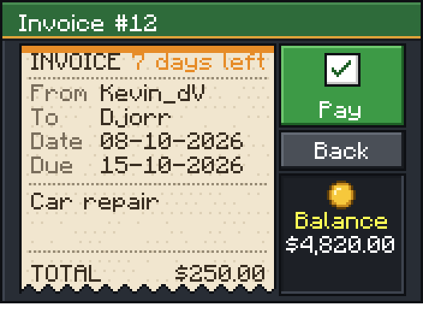
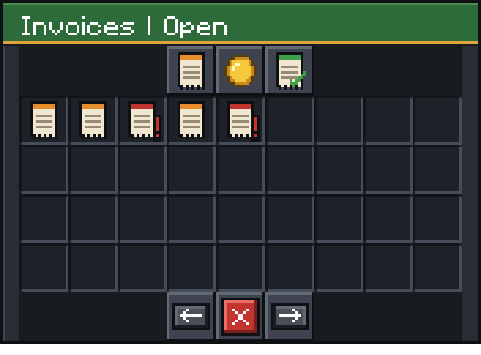
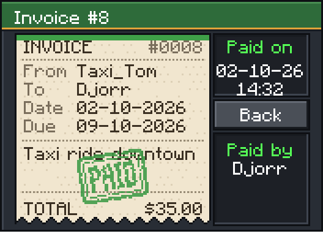
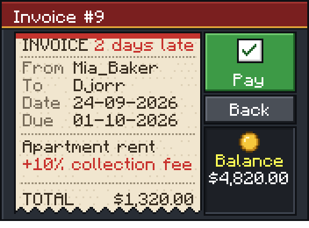
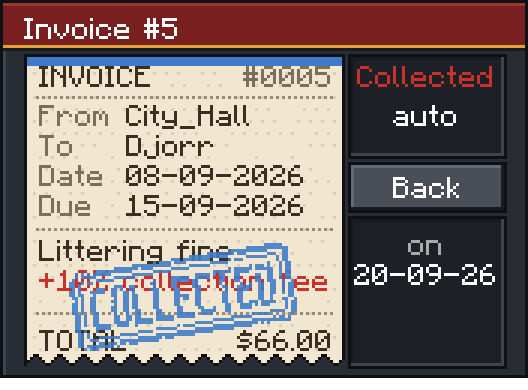

# Billify

A powerful and configurable invoice system inspired by FiveM servers, perfect for roleplay and economy-based Minecraft servers.

## Overview

The Billify plugin is compatible with Minecraft versions **1.8 - 1.21**. This system integrates smoothly with roleplay environments, adding realism by allowing players to send and manage invoices.

## Receipt resource pack



Billify ships with an optional resource pack ([`resourcepack/Billify-ResourcePack.zip`](resourcepack/Billify-ResourcePack.zip)) that turns the menus into paper receipts with stamps and custom icons. It is sent on join (see `RESOURCE_PACK` in `config.yml`); players without the pack get the classic menus. Requires 1.20+ clients and a 1.14+ server.

| | |
|---|---|
|  |  |
|  |  |

All textures are generated by [`tools/resourcepack/generate.py`](tools/resourcepack/generate.py):

```
python tools/resourcepack/generate.py <path to a 1.20+ Minecraft client jar>
```

It rebuilds the pack, `src/main/resources/billify-font.properties` (glyph metrics the plugin uses to place text on the receipt) and the preview images in `docs/images`.

Every text, including the words on the receipt, lives in `language_EN.yml` / `language_NL.yml`.

## Features

- **Customizable Invoice Menu**: Offers a flexible, user-friendly GUI where players can view open and closed invoices. 
- **Multiple Access Options**: Players can open the invoice menu via commands or by interacting with specific items or blocks in the game world.
- **Configurable Commands & Permissions**: Easily modify command aliases and permissions directly in the configuration file to suit your server’s needs.
- **Right-Click Activation**: Supports menu access by right-clicking a specified item (default: PAPER) or block (default: RED_SANDSTONE_STAIRS), adding a unique interaction method for players.
- **Rank-Based Permissions**: Control who can create, view, and manage invoices based on ranks, with options to set specific permissions and transaction limits per rank.
- **Payment Settings**: Allows you to set a custom expiration period for invoices. If an invoice isn’t paid within the specified time (default: 7 days), the system automatically processes it.
- **Vault Integration**: Seamless support for Vault as the default economy handler, with custom commands for non-Vault servers.
- **Detailed Economy Commands**: If Vault isn’t used, configure custom commands to handle balance additions and deductions for players.
- **Dynamic Configurations**: Modify nearly every aspect of the plugin in the configuration file, from item interactions to invoice permissions and more.

## Commands and Permissions

- **`/invoice`** - Opens the GUI with all open and closed invoices.
  - **Aliases**: Command aliases are configurable (e.g., `/inv`, `/invmenu`).
  
### Permissions

Permissions are fully configurable in the `config.yml` file. Specific ranks can have permissions to:
  - **Create invoices**
  - **Cancel invoices**
  - **View invoices** (optional for staff roles only)
  
Set permissions by rank to control invoice capabilities on your server.

## Requirements

- **Vault**: Make sure Vault is installed for seamless economy management. If Vault isn’t used, configure custom commands for adding or deducting player balances.

## Support

If you need help or have questions, join our support server: [Rubix Development Discord](https://discord.gg/vwysWvaner)

Need a custom plugin or another project? We are available for hire - ask in the Discord.
